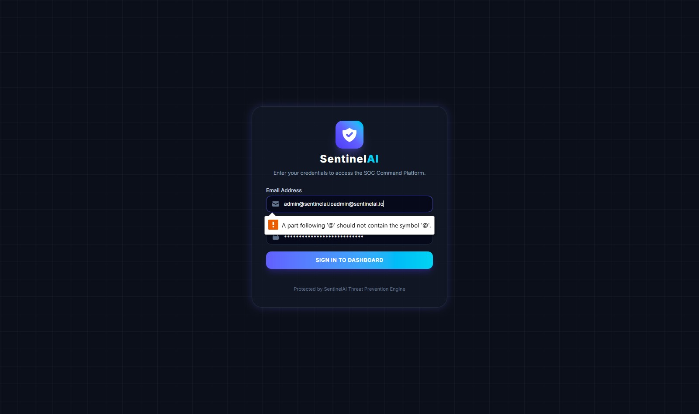

<div align="center">

# 🛡️ SentinelAI

### Enterprise AI-Powered Security Operations Center (SOC) Dashboard

[](https://ai-powered-soc-dashboard.vercel.app)

[](https://fastapi.tiangolo.com)
[](https://react.dev)
[](https://tailwindcss.com)
[](https://scikit-learn.org)
[](https://mongodb.com)
[](https://docker.com)
[](LICENSE)

**An enterprise-grade SOC platform leveraging Artificial Intelligence & Machine Learning to ingest multi-format security logs, detect zero-day threats in real time, automate incident response playbooks (SOAR), and assist security analysts via a natural language AI chatbot.**

---

### 🌐 Live Production Dashboard
### 🚀 **[https://ai-powered-soc-dashboard.vercel.app](https://ai-powered-soc-dashboard.vercel.app)**

*Default Demo Login:* `admin@sentinelai.io` / `AdminSecret123!`

---

[Explore Docs](docs/SRS.md) · [API Specs](docs/API_DOCUMENTATION.md) · [Architecture](docs/ARCHITECTURE.md) · [Live Deployment Guide](docs/DEPLOYMENT_GUIDE.md)

</div>

---

## 🖼️ Application Previews & Screenshots

### 📊 1. SOC Command Center Overview (`/`)
> Real-time security telemetry monitoring total logs, critical alert bursts, threat risk scores, 24-hour attack timelines, and live threat streams.



---

### 🤖 2. AI Security Assistant & SOAR Playbook Execution
> Floating AI Chatbot drawer analyzing natural language queries, writing automated firewall block scripts, and triggering 1-click SOAR IP containment actions.


---

## ✨ Key Features & Capabilities

| Module | Features & Technical Description |
| :--- | :--- |
| 🔍 **Multi-Source Log Collector** | Ingests and normalizes logs from Windows Event Logs (`4624`, `4625`, `1102`), Linux Syslog/auth.log, Nginx/Apache Combined Access Logs, and Firewall IPTables |
| 🛡️ **Rule-Based Threat Detection** | Signature-based regex matching for SQL Injection, Cross-Site Scripting (XSS), SSH Brute Force, Directory Traversal, and Command/PowerShell Injection |
| 🌲 **ML Anomaly Detection** | Unsupervised `IsolationForest` machine learning engine scoring zero-day anomalous log behavior |
| 🚨 **Interactive Alerts Center** | Filter alerts by severity, update investigation status (`NEW` ➔ `IN_PROGRESS` ➔ `RESOLVED`), and inspect MITRE ATT&CK mappings (`T1110`, `T1190`) with AI advice |
| 📋 **Incident Management** | Lifecycle case management, analyst assignment, priority classification (`CRITICAL`, `HIGH`, `MEDIUM`), and response timeline tracking |
| 🌐 **Threat Intelligence Hub** | Real-time IP, domain, and file hash reputation lookups using AbuseIPDB confidence scores, Shodan open ports, and VirusTotal malware signatures |
| ⚡ **SOAR Automation Engine** | Automated security response playbooks: `CONTAIN_IP` (iptables DROP), `ISOLATE_HOST`, `REVOKE_USER`, and `GENERATE_YARA` |
| 🤖 **AI Chatbot Assistant** | Floating natural language SOC assistant answering security queries, offering remediation advice, and generating CLI containment scripts |
| 📄 **Reporting & Compliance** | Downloadable CSV alert exports and executive JSON security posture summary briefs |
| 📡 **Real-Time Monitoring** | Multi-channel WebSockets hub (`/ws/stream`) and instant toast notifications |

---

## 🏗️ System Architecture

```
┌────────────────────────────────────────────────────────────────────────┐
│                        PRESENTATION TIER (UI)                          │
│     React 19 + Vite 8 + Tailwind CSS v4 + Chart.js (Port 5173)         │
└──────────────────────────────────┬─────────────────────────────────────┘
                                   │ REST API & WebSockets WSS
┌──────────────────────────────────▼─────────────────────────────────────┐
│                       FASTAPI BACKEND SERVICES                         │
│  ├── /api/v1/auth          (JWT Auth, Refresh Tokens, RBAC)            │
│  ├── /api/v1/dashboard     (Live MongoDB Telemetry & Aggregations)    │
│  ├── /api/v1/alerts        (Threat Filtering & Status Patching)        │
│  ├── /api/v1/logs          (Log Ingestion, File Upload, Query)        │
│  ├── /api/v1/incidents     (Incident Lifecycle, Timeline, Resolution)  │
│  ├── /api/v1/threat-intel  (VirusTotal, AbuseIPDB, Domain/Hash Lookup) │
│  ├── /api/v1/reports       (CSV Alert Export & Executive JSON Summary) │
│  ├── /api/v1/ai-assistant  (Natural Language Security Chatbot)       │
│  ├── /api/v1/soar          (Automated IP Containment Playbooks)        │
│  └── /ws/stream            (Multi-Channel WebSocket Broadcast Hub)    │
└────────────────┬─────────────────────────────────┬─────────────────────┘
                 │                                 │
┌────────────────▼───────────────┐ ┌───────────────▼─────────────────────┐
│    THREAT DETECTION ENGINE     │ │           STORAGE TIER              │
│  ├── Rule-Based Signatures     │ │  ├── MongoDB 7 (Motor Async Driver) │
│  │   (SQLi, XSS, BruteForce)   │ │  │   └── Users, Alerts, Incidents, │
│  └── ML Anomaly Model          │ │  │       Logs, ThreatIntel, Audit  │
│      (Isolation Forest)        │ │  └── Redis 7 (Caching & Pub/Sub)    │
└────────────────────────────────┘ └─────────────────────────────────────┘
```

---

## 🛠️ Technology Stack

| Component | Technology | Rationale / Usage |
| :--- | :--- | :--- |
| **Frontend** | React 19, Vite 8, Tailwind CSS v4 | High-performance, glassmorphic UI components with dark mode |
| **Backend** | Python 3.12, FastAPI, Uvicorn | Async REST API framework with native OpenAPI documentation |
| **AI / Machine Learning** | Scikit-Learn, Pandas, NumPy | `IsolationForest` anomaly model & 10D feature vector extraction |
| **Database** | MongoDB 7 (Motor async driver) | Document storage for Users, Alerts, Incidents, and normalized Logs |
| **Cache & Real-Time** | Redis 7 & WebSockets (`/ws/stream`) | In-memory session state & live alert event broadcasting |
| **Authentication** | JWT, Passlib (bcrypt), RBAC | Role-Based Access Control (`ADMIN`, `ANALYST`, `VIEWER`) |
| **DevOps & Containers** | Docker, Docker Compose, Nginx | Multi-stage production container builds and SPA reverse proxying |

---

## ⚡ Quick Start Guide (Local Development)

### 1. Prerequisites
- **Python 3.10+**
- **Node.js 20+**
- **MongoDB 7+** *(Optional - built-in fallback mode enabled if offline)*

### 2. Database Seeding (Optional)
```bash
python scripts/seed_db.py
```

### 3. Launch Backend API Server
```bash
uvicorn backend.main:app --port 8000 --reload
```
* Backend API & Root Page: [http://localhost:8000](http://localhost:8000)
* Interactive Swagger Docs: [http://localhost:8000/docs](http://localhost:8000/docs)

### 4. Launch React Frontend Dashboard
```bash
cd frontend
npm run dev
```
* Dashboard Web App: [http://localhost:5173](http://localhost:5173)

---

## 🔒 Default Access Credentials

| Role | Email | Password |
| :--- | :--- | :--- |
| **SecOps Admin** | `admin@sentinelai.io` | `AdminSecret123!` |
| **Security Analyst** | `analyst@sentinelai.io` | `AnalystSecret123!` |

---

## 🌐 Live Cloud Deployment

| Component | Live Host | URL / Configuration File |
| :--- | :--- | :--- |
| **Frontend** | **Vercel** | 🚀 **[https://ai-powered-soc-dashboard.vercel.app](https://ai-powered-soc-dashboard.vercel.app)** |
| **Backend** | **Render / Railway** | [`render.yaml`](file:///d:/STUFF/AI%20Powered%20SOC%20Dashboard/SentinelAI/render.yaml) & [`Procfile`](file:///d:/STUFF/AI%20Powered%20SOC%20Dashboard/SentinelAI/Procfile) |
| **Database** | **MongoDB Atlas** | Cloud URI in `.env` |

> See the full step-by-step deployment guide in **[`docs/DEPLOYMENT_GUIDE.md`](file:///d:/STUFF/AI%20Powered%20SOC%20Dashboard/SentinelAI/docs/DEPLOYMENT_GUIDE.md)**.

---

## 🧪 Automated Testing

Run the full `pytest` test suite:
```bash
python -m pytest tests/ -v
```
Output: `8 passed in 1.63s` ✅

---

## 📜 Documentation Index

* 📄 [Software Requirements Specification (SRS)](docs/SRS.md)
* 🏗️ [System Architecture Specification](docs/ARCHITECTURE.md)
* 🗄️ [Database Design & Collections](docs/DATABASE_DESIGN.md)
* 🌐 [REST API & WebSocket Documentation](docs/API_DOCUMENTATION.md)
* ☁️ [Cloud Deployment Guide](docs/DEPLOYMENT_GUIDE.md)

---

<div align="center">

**Built with ❤️ for Cybersecurity Professionals & Security Operation Centers**

</div>
