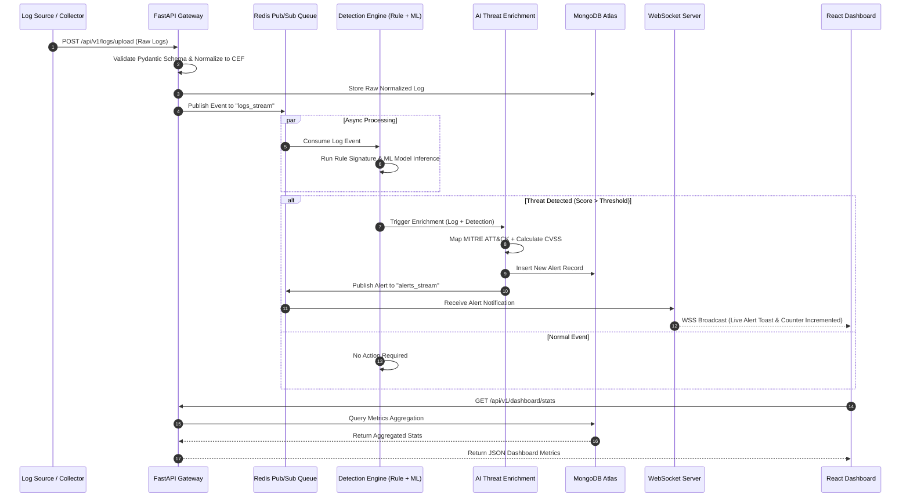

# System Architecture Document
## Project Name: SentinelAI – Enterprise AI-Powered SOC Dashboard
**Document Version:** 1.0.0  
**Date:** July 2026  
**Status:** Approved  
**Author:** SentinelAI Systems Architecture Team  

---

## 1. High-Level System Architecture Overview

SentinelAI is built as a high-performance, asynchronous microservices-oriented architecture designed to handle thousands of events per second while delivering sub-second real-time alert notifications and machine learning threat detections.

The architecture comprises six key tiers:
1. **Client / Presentation Layer:** React 18 single-page application built with Vite, Tailwind CSS, Chart.js, React Query, and WebSocket client.
2. **API Gateway & Core Services Layer:** FastAPI ASGI application hosted with Uvicorn worker process pools, managing REST routing, JWT authentication, and request middleware.
3. **Processing & Detection Layer:** Decoupled log ingestion workers, rule-based detection engine, and machine learning inference models (Isolation Forest, Random Forest, XGBoost).
4. **AI Threat Enrichment Engine:** MITRE ATT&CK taxonomy mapper, dynamic CVSS scorer, and response playbook generator.
5. **Storage & Caching Layer:** MongoDB for primary persistent document storage and Redis for high-speed caching, rate limiting, and Pub/Sub event distribution.
6. **External Integration Layer:** Connectors to VirusTotal, AbuseIPDB, Shodan, CVE databases, and GeoIP provider.

### 1.1 High-Level Architecture Diagram

```mermaid
graph TB
    subgraph Client_Layer ["1. Client / Presentation Layer"]
        UI["React 18 Dashboard SPA (Vite + Tailwind)"]
        Charts["Chart.js / Geo Mapping Component"]
        WS_Client["WebSocket Client (Real-Time Updates)"]
    end

    subgraph Gateway_Auth ["2. API Gateway & Auth Tier"]
        API_GW["FastAPI Core Gateway / Router"]
        Auth_Svc["Auth Module (JWT / Passlib / RBAC)"]
        Rate_Limit["Redis Rate Limiter Middleware"]
    end

    subgraph Ingestion_Processing ["3. Log Collection & Processing Tier"]
        Collector["Log Collector & Normalizer Engine"]
        Rule_Engine["Rule-Based Threat Engine (Regex / Signatures)"]
        ML_Engine["ML Anomaly Engine (Isolation Forest, XGBoost)"]
    end

    subgraph AI_Enrichment ["4. AI Threat Analysis & Intel Tier"]
        AI_Analysis["AI Analysis & MITRE ATT&CK Mapper"]
        CVSS_Calc["Dynamic CVSS Scorer"]
        TI_Gateway["Threat Intelligence Connector"]
    end

    subgraph RealTime_Tier ["5. Real-Time Event Hub"]
        WS_Server["FastAPI WebSocket Server"]
        PubSub["Redis Pub/Sub Event Broker"]
    end

    subgraph Data_Layer ["6. Storage Tier"]
        Mongo [["MongoDB Atlas (Users, Alerts, Incidents, Logs)"]]
        RedisCache [["Redis Cloud (Session, Cache, Queue)"]]
    end

    subgraph External_APIs ["7. External Threat Intel Services"]
        VT["VirusTotal API"]
        Abuse["AbuseIPDB API"]
        Shodan["Shodan API"]
        GeoIP["MaxMind GeoIP DB"]
    end

    %% Client Interactions
    UI -->|HTTP REST / JSON| API_GW
    WS_Client <-->|WSS Bi-directional| WS_Server

    %% Gateway & Auth
    API_GW --> Auth_Svc
    API_GW --> Rate_Limit
    Rate_Limit <--> RedisCache
    Auth_Svc <--> Mongo

    %% Processing Flow
    API_GW --> Collector
    Collector -->|CEF Normalized Logs| PubSub
    PubSub --> Rule_Engine
    PubSub --> ML_Engine

    %% Threat Detection to AI
    Rule_Engine -->|Rule Hits| AI_Analysis
    ML_Engine -->|Anomaly Hits| AI_Analysis
    AI_Analysis --> CVSS_Calc
    AI_Analysis --> TI_Gateway

    %% External APIs
    TI_Gateway <--> VT
    TI_Gateway <--> Abuse
    TI_Gateway <--> Shodan
    TI_Gateway <--> GeoIP

    %% Data Persistence
    Collector --> Mongo
    AI_Analysis -->|Alerts & Intelligence| Mongo
    TI_Gateway <-->|Cache 24h| RedisCache

    %% Real-Time Broadcast
    AI_Analysis -->|Publish Threat Alerts| PubSub
    PubSub --> WS_Server
```

---

## 2. Detailed Component Descriptions

### 2.1 Client / Presentation Layer (Frontend)
* **React 18 & Vite:** Provides a fast, single-page UI rendering environment with instant Hot Module Replacement (HMR) during development and optimized production bundles.
* **Tailwind CSS:** Enterprise SOC dark-mode UI design system ensuring high readability under low-light conditions.
* **Chart.js & React-Chartjs-2:** Renders interactive attack timelines, threat breakdown pie charts, hourly distribution bar graphs, and metric trends.
* **React Query (TanStack Query):** Handles async data fetching, automatic caching, re-fetching, and state management for REST endpoints.
* **Axios:** Centralized HTTP client configured with request/response interceptors to automatically inject JWT Bearer tokens and handle silent refresh upon receiving HTTP 401.
* **WebSocket Client:** Maintains persistent `wss://` connection to receive live logs, alert toasts, and counter updates.

### 2.2 API Gateway & Core Application Server (Backend)
* **FastAPI:** High-performance Python ASGI web framework built on Starlette and Pydantic, executing asynchronous endpoints concurrently.
* **Uvicorn:** Production-grade ASGI server executing multiple process workers behind an Nginx reverse proxy.
* **Pydantic V2:** Enforces strict data validation, serialization, and type checking for request models and response schemas.
* **Authentication & RBAC Service:** Enforces access policies for `Admin`, `Security Analyst`, and `Viewer` roles; validates JWT signatures using HMAC SHA-256 (`HS256`).

### 2.3 Log Collection & Processing Tier
* **Log Ingestion Engine:** Accepts raw logs via HTTP file upload or REST streams. Supports Windows EVTX, Linux Syslog, Apache, Nginx, Suricata EVE, Zeek, and custom JSON formats.
* **Normalizer & Parser:** Standardizes varying field names into Common Event Format (`timestamp`, `hostname`, `service`, `source_ip`, `destination_ip`, `log_type`, `severity`).
* **Deduplication Engine:** Leverages Redis set hashes to drop duplicate log messages received within a 5-second window.

### 2.4 Hybrid Threat Detection Engine
* **Rule-Based Detection Engine:** Executes signature matching for known threats:
  - Brute force detection algorithm (sliding window count).
  - Web attack pattern matching (SQLi, XSS, Path Traversal, Command Injection).
  - Malicious PowerShell flag parser (`-EncodedCommand`, `-W Hidden`).
* **Machine Learning Anomaly Engine:** Runs incoming normalized feature vectors through trained models:
  - **Isolation Forest:** Detects non-linear anomalies in traffic volume and event frequency.
  - **XGBoost & Random Forest:** Classifies complex multi-feature vectors into threat categories.
  - **Joblib Model Loader:** Dynamically loads updated model weights into memory without service restart.

### 2.5 AI Threat Enrichment Engine
* **MITRE ATT&CK Mapping Module:** Translates alert indicators into standardized MITRE Tactics & Techniques (e.g., T1110 - Brute Force; T1059 - Command and Scripting Interpreter).
* **Dynamic CVSS Scorer:** Computes Base CVSS v3.1 scores using vector metrics (Exploitability, Privileges Required, User Interaction, Scope, Confidentiality/Integrity/Availability Impact).
* **Playbook Generator:** Automatically attaches contextual remediation steps based on threat type and risk score.

### 2.6 Storage & Real-Time Messaging Tier
* **MongoDB (Motor Driver):** Asynchronous MongoDB client interacting with Collections (`Users`, `Alerts`, `Incidents`, `Logs`, `ThreatIntelligence`, `AuditLog`, `NotificationSettings`).
* **Redis Cloud / Redis Container:** Multipurpose in-memory store providing:
  - **Pub/Sub:** Decouples log ingestion from threat detection workers and WebSocket server.
  - **Cache:** Caches threat intelligence API responses (24h TTL) and JWT blacklist.
  - **Rate Limiter:** Token bucket counter for API endpoint defense.

---

## 3. End-to-End Data Flow Architecture

The following diagram illustrates how raw logs move through processing, detection, enrichment, database persistence, and real-time visualization.



---

## 4. Technology Stack Matrix

| Layer / Category | Technology | Version | Purpose & Rationale |
| :--- | :--- | :--- | :--- |
| **Frontend Framework** | React | 18.2.0 | Component-based interactive UI rendering |
| **Frontend Build Tool** | Vite | 5.x | Ultra-fast bundling, HMR, lightweight build artifact |
| **Styling Framework** | Tailwind CSS | 3.4.x | Utility-first dark-mode styling for enterprise SOC |
| **Data Visualization** | Chart.js / React-Chartjs-2 | 4.4.x | Canvas-based high-performance chart rendering |
| **Frontend State / Async** | React Query (TanStack) | 5.x | Data fetching, background synchronization & caching |
| **HTTP Client** | Axios | 1.6.x | Promise-based HTTP client with token interceptors |
| **Backend Framework** | Python / FastAPI | 0.109+ | Async ASGI framework with native Pydantic validation |
| **ASGI Server** | Uvicorn | 0.27+ | Multi-worker lightning-fast web server |
| **Database (Primary)** | MongoDB (Motor Driver) | 6.0+ | Schema-less document database for logs and alerts |
| **Cache & Message Broker** | Redis | 7.2+ | In-memory Pub/Sub, rate limiting, and TI caching |
| **Machine Learning** | Scikit-learn, XGBoost | 1.4+, 2.0+ | Model training and inference (Isolation Forest, etc.) |
| **Data Manipulation** | Pandas, NumPy | 2.2+, 1.26+ | Data preprocessing, feature vector construction |
| **Model Persistence** | Joblib | 1.3+ | Serialization and fast loading of trained ML artifacts |
| **Auth & Encryption** | PyJWT, Passlib (Bcrypt) | 2.8+, 1.7+ | JWT token creation/verification & password hashing |
| **Real-Time Communication**| WebSockets (FastAPI WSS) | Native | Bi-directional streaming for live logs and alerts |
| **Containerization** | Docker, Docker Compose | 25.x, 2.x | Multi-container orchestration (App, Database, Redis) |
| **Web Server / Reverse Proxy**| Nginx | 1.25+ | TLS termination, load balancing, static file hosting |
| **Cloud Hosting** | AWS EC2, Vercel, Atlas | - | Distributed cloud hosting architecture |

---

## 5. Deployment Architecture

SentinelAI is deployed using a hybrid cloud deployment architecture designed for high availability, security isolation, and independent scalability.

```mermaid
graph TB
    subgraph Client_Domain ["Client Browser"]
        UserBrowser["User Web Browser"]
    end

    subgraph CDN_Vercel ["Vercel Global CDN (Frontend)"]
        Vercel_Edge["Vercel Edge Network"]
        Static_React["React Static Bundle (HTML/JS/CSS)"]
    end

    subgraph AWS_EC2 ["AWS EC2 VPC (Backend Services)"]
        Nginx_LB["Nginx Reverse Proxy & SSL Termination (Port 443)"]
        
        subgraph Docker_Compose ["Docker Compose Environment"]
            API_1["FastAPI Worker Container 1"]
            API_2["FastAPI Worker Container 2"]
            ML_Worker["AI/ML Processing Worker Container"]
            WS_Service["WebSocket Streamer Container"]
        end
    end

    subgraph Managed_Cloud_Services ["Managed Cloud Services"]
        Mongo_Atlas[("MongoDB Atlas (Replica Set)")]
        Redis_Cloud[("Redis Cloud (Master/Replica)")]
    end

    subgraph Ext_Intel ["Threat Intel APIs"]
        VT_API["VirusTotal API"]
        Abuse_API["AbuseIPDB API"]
    end

    %% Edge & Client Connections
    UserBrowser -->|1. Fetch UI Assets| Vercel_Edge
    Vercel_Edge --> Static_React
    UserBrowser -->|2. HTTPS REST / WSS| Nginx_LB

    %% Load Balancer Distribution
    Nginx_LB -->|Port 8000| API_1
    Nginx_LB -->|Port 8000| API_2
    Nginx_LB -->|Port 8001 (WSS)| WS_Service

    %% Container to Service Interconnects
    API_1 <--> Redis_Cloud
    API_2 <--> Redis_Cloud
    ML_Worker <--> Redis_Cloud
    WS_Service <--> Redis_Cloud

    API_1 <--> Mongo_Atlas
    API_2 <--> Mongo_Atlas
    ML_Worker <--> Mongo_Atlas

    %% Threat Intel
    ML_Worker <--> VT_API
    ML_Worker <--> Abuse_API
```

---

## 6. Communication Protocols & Standards

### 6.1 RESTful APIs (HTTP/2 over TLS 1.3)
* **Protocol:** `HTTPS`
* **Data Format:** `application/json`
* **Authentication:** `Authorization: Bearer <JWT_ACCESS_TOKEN>`
* **Usage:** CRUD operations for users, alerts, incidents, reports, and administrative configurations.

### 6.2 Real-Time WebSockets (WSS Protocol)
* **Protocol:** `WSS` (WebSocket Secure)
* **Endpoint:** `wss://api.sentinelai.io/ws/v1/stream`
* **Handshake Authentication:** Query parameter token parameter `?token=<JWT_ACCESS_TOKEN>`.
* **Framing:** JSON object frames containing `event_type` (`log_event`, `alert_triggered`, `metrics_update`) and `data` payload.

### 6.3 Asynchronous Message Queuing (Redis Pub/Sub)
* **Channel `logs_stream`:** Raw normalized log payloads dispatched by FastAPI Gateway for consumption by Rule and ML threat workers.
* **Channel `alerts_stream`:** Triggered alerts published by AI Engine for immediate broadcast by WebSocket workers.
