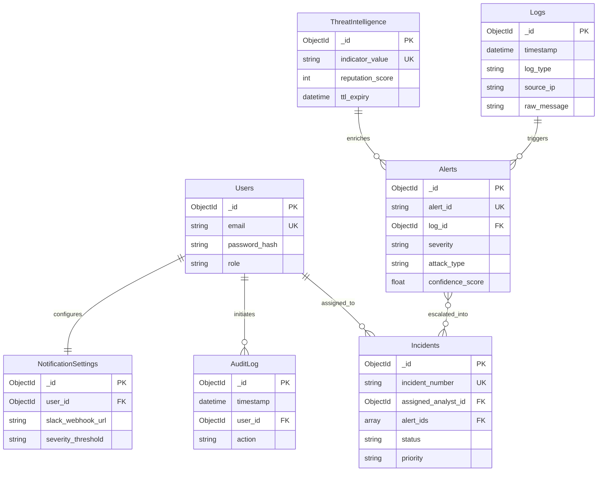

# Database Design Specification
## Project Name: SentinelAI – Enterprise AI-Powered SOC Dashboard
**Document Version:** 1.0.0  
**Date:** July 2026  
**Status:** Approved  
**Database System:** MongoDB 6.0+ (Motor Async Python Driver)  

---

## 1. Database Architecture & Overview

SentinelAI uses **MongoDB** as its core document database alongside **Redis** for in-memory caching and message queuing. MongoDB's schema-flexibility, powerful aggregation framework, time-series capabilities, and horizontal sharding support make it ideal for storing high-volume security logs, alert metadata, complex incident timelines, and threat intelligence records.

### Key Database Architectural Principles:
* **Asynchronous I/O:** All database operations execute asynchronously via the Python `Motor` driver (`motor.motor_asyncio.AsyncIOMotorClient`).
* **Optimized Indexing:** Compound and TTL (Time-To-Live) indexes are defined to ensure sub-50ms query responses over millions of log documents.
* **Referential Integrity via ObjectIds:** Weak relationships between collections are maintained through `ObjectId` references (e.g., `assigned_analyst_id` in `Incidents` linking to `_id` in `Users`).
* **Schema Validation:** Strict JSON Schema Validation is enforced at the MongoDB collection level to maintain data integrity.

---

## 2. Collection Schemas & Data Models

### 2.1 `Users` Collection
Stores user account profiles, hashed credentials, assigned roles, and authentication status.

| Field Name | Data Type | Required | Description | Constraints & Default |
| :--- | :--- | :---: | :--- | :--- |
| `_id` | `ObjectId` | Yes | Primary Key | Auto-generated |
| `name` | `String` | Yes | Full name of the user | 2-100 chars |
| `email` | `String` | Yes | Primary email address | Unique, Lowercase |
| `password_hash` | `String` | Yes | Bcrypt/Argon2 password hash | Min 60 chars |
| `role` | `String` | Yes | Access role | `Admin`, `Security Analyst`, `Viewer` |
| `is_active` | `Boolean` | Yes | Account active status | Default: `true` |
| `last_login` | `DateTime` | No | Timestamp of last authentication | Nullable |
| `created_at` | `DateTime` | Yes | Account creation timestamp | Default: `UTC Now` |
| `updated_at` | `DateTime` | Yes | Account modification timestamp | Default: `UTC Now` |

---

### 2.2 `Alerts` Collection
Stores threat alerts generated by rule matching or ML anomaly detection models.

| Field Name | Data Type | Required | Description | Constraints & Default |
| :--- | :--- | :---: | :--- | :--- |
| `_id` | `ObjectId` | Yes | Primary Key | Auto-generated |
| `alert_id` | `String` | Yes | Unique alert identifier | Unique (e.g., `ALT-98421`) |
| `timestamp` | `DateTime` | Yes | Event trigger timestamp | Indexed |
| `log_id` | `ObjectId` | Yes | Reference to originating log | Foreign Key (`Logs._id`) |
| `severity` | `String` | Yes | Risk level | `Critical`, `High`, `Medium`, `Low` |
| `attack_type` | `String` | Yes | Categorized attack classification | `Brute Force`, `SQLi`, `XSS`, etc. |
| `confidence_score`| `Float` | Yes | ML/Rule confidence rating | Range: `0.0` - `1.0` |
| `source_ip` | `String` | Yes | Originating IPv4/IPv6 address | Valid IP format |
| `destination_ip` | `String` | Yes | Target IPv4/IPv6 address | Valid IP format |
| `country` | `String` | No | Resolved GeoIP country code | 2-char ISO (e.g., `US`, `DE`) |
| `status` | `String` | Yes | Current alert state | `New`, `Investigating`, `Resolved`, `False Positive` |
| `mitre_attack` | `Object` | Yes | MITRE ATT&CK Mapping object | Contains `technique_id`, `technique_name`, `tactic` |
| `cvss_score` | `Float` | Yes | Computed CVSS score | Range: `0.0` - `10.0` |
| `ai_analysis` | `Object` | Yes | AI Threat Analysis subdocument | Contains `summary`, `recommendations` array |
| `created_at` | `DateTime` | Yes | Alert insertion timestamp | Default: `UTC Now` |

---

### 2.3 `Incidents` Collection
Tracks escalated security incidents, analyst assignments, timelines, evidence, and resolution states.

| Field Name | Data Type | Required | Description | Constraints & Default |
| :--- | :--- | :---: | :--- | :--- |
| `_id` | `ObjectId` | Yes | Primary Key | Auto-generated |
| `incident_number` | `String` | Yes | Human-readable incident number | Unique (e.g., `INC-2026-0042`) |
| `title` | `String` | Yes | Incident title summary | 5-200 chars |
| `description` | `String` | Yes | Detailed incident description | Text |
| `assigned_analyst_id`| `ObjectId`| No | Assigned Analyst reference | Foreign Key (`Users._id`) |
| `priority` | `String` | Yes | SLA priority level | `P1 - Critical`, `P2 - High`, `P3 - Medium`, `P4 - Low` |
| `status` | `String` | Yes | Incident lifecycle state | `Open`, `In Progress`, `Mitigated`, `Closed` |
| `alert_ids` | `Array[ObjectId]`| Yes | Linked threat alerts | Array of `Alerts._id` |
| `timeline` | `Array[Object]`| Yes | Chronological audit timeline | Array of event objects |
| `evidence` | `Array[Object]`| No | Attached files and artifacts | Array of evidence metadata |
| `resolution_notes`| `String` | No | Analyst resolution statement | Text |
| `created_at` | `DateTime` | Yes | Creation timestamp | Default: `UTC Now` |
| `updated_at` | `DateTime` | Yes | Modification timestamp | Default: `UTC Now` |

---

### 2.4 `Logs` Collection
Stores normalized security event logs ingested from all system sources.

| Field Name | Data Type | Required | Description | Constraints & Default |
| :--- | :--- | :---: | :--- | :--- |
| `_id` | `ObjectId` | Yes | Primary Key | Auto-generated |
| `timestamp` | `DateTime` | Yes | Original event timestamp | Indexed (TTL 90 days) |
| `hostname` | `String` | Yes | Source machine hostname/FQDN | String |
| `service` | `String` | Yes | Application or daemon service | `sshd`, `nginx`, `suricata`, etc. |
| `source_ip` | `String` | No | Origin IP address | Valid IP format |
| `destination_ip` | `String` | No | Destination IP address | Valid IP format |
| `log_type` | `String` | Yes | Source category | `Windows`, `Linux`, `Apache`, `Nginx`, `Firewall`, `Suricata`, `Zeek`, `Custom` |
| `severity` | `String` | Yes | Event severity level | `Emergency`, `Alert`, `Critical`, `Error`, `Warning`, `Notice`, `Info`, `Debug` |
| `raw_message` | `String` | Yes | Original unparsed log string | Text |
| `parsed_fields` | `Object` | Yes | Extracted key-value attributes | Key-value store |
| `normalized_event`| `Object` | Yes | Standardized CEF payload | Schema object |
| `created_at` | `DateTime` | Yes | Database write timestamp | Default: `UTC Now` |

---

### 2.5 `ThreatIntelligence` Collection
Caches external reputation data retrieved from VirusTotal, AbuseIPDB, Shodan, CVE DB, and GeoIP.

| Field Name | Data Type | Required | Description | Constraints & Default |
| :--- | :--- | :---: | :--- | :--- |
| `_id` | `ObjectId` | Yes | Primary Key | Auto-generated |
| `indicator_type` | `String` | Yes | Type of IOC | `IP`, `Domain`, `FileHash` |
| `indicator_value` | `String` | Yes | Value of indicator | Unique (e.g., `185.220.101.5`) |
| `reputation_score`| `Integer` | Yes | Aggregated risk score (0-100) | 0 (Clean) to 100 (Malicious) |
| `virustotal_data` | `Object` | No | VirusTotal API payload cache | JSON Object |
| `abuseipdb_data` | `Object` | No | AbuseIPDB response cache | JSON Object |
| `shodan_data` | `Object` | No | Shodan response cache | JSON Object |
| `cve_data` | `Object` | No | CVE vulnerability mapping | JSON Object |
| `geoip_data` | `Object` | No | MaxMind GeoIP metadata | Contains country, city, ASN |
| `last_updated` | `DateTime` | Yes | Cache update timestamp | Default: `UTC Now` |
| `ttl_expiry` | `DateTime` | Yes | Expiration timestamp | Indexed TTL (24 hours) |

---

### 2.6 `AuditLog` Collection
Maintains an immutable record of administrative actions, user logins, and operational state changes.

| Field Name | Data Type | Required | Description | Constraints & Default |
| :--- | :--- | :---: | :--- | :--- |
| `_id` | `ObjectId` | Yes | Primary Key | Auto-generated |
| `timestamp` | `DateTime` | Yes | Action execution timestamp | Indexed |
| `user_id` | `ObjectId` | No | Performing user ID | Foreign Key (`Users._id`) |
| `user_email` | `String` | Yes | Performing user email | String |
| `action` | `String` | Yes | Performed operation | `USER_LOGIN`, `INCIDENT_CLOSED`, `RULE_UPDATE` |
| `resource` | `String` | Yes | Targeted system resource | Collection or API route |
| `ip_address` | `String` | Yes | Client IP address | String |
| `user_agent` | `String` | No | Client browser user agent | String |
| `status` | `String` | Yes | Execution result | `SUCCESS`, `FAILURE`, `DENIED` |
| `details` | `Object` | No | Contextual metadata | Key-value store |

---

### 2.7 `NotificationSettings` Collection
Stores user-specific multi-channel notification preferences and integration webhooks.

| Field Name | Data Type | Required | Description | Constraints & Default |
| :--- | :--- | :---: | :--- | :--- |
| `_id` | `ObjectId` | Yes | Primary Key | Auto-generated |
| `user_id` | `ObjectId` | Yes | Associated user reference | Unique Foreign Key (`Users._id`) |
| `email_enabled` | `Boolean` | Yes | Email notifications toggle | Default: `true` |
| `slack_webhook_url`| `String` | No | Slack Webhook URL | Valid HTTP/HTTPS URL |
| `discord_webhook_url`| `String`| No | Discord Webhook URL | Valid HTTP/HTTPS URL |
| `desktop_enabled`| `Boolean` | Yes | Browser notification toggle | Default: `true` |
| `severity_threshold`| `String`| Yes | Minimum severity trigger | `Critical`, `High`, `Medium`, `Low` |
| `created_at` | `DateTime` | Yes | Record creation timestamp | Default: `UTC Now` |
| `updated_at` | `DateTime` | Yes | Record update timestamp | Default: `UTC Now` |

---

## 3. Database Indexes Strategy

Indexes are explicitly defined on high-cardinality and frequently queried fields to ensure scalable execution under high load.

| Collection | Index Name | Index Keys | Type / Options | Purpose |
| :--- | :--- | :--- | :--- | :--- |
| `Users` | `idx_users_email` | `{ email: 1 }` | Unique | Fast user lookup & unique email constraint |
| `Alerts` | `idx_alerts_id` | `{ alert_id: 1 }` | Unique | Quick alert retrieval |
| `Alerts` | `idx_alerts_ts_sev` | `{ timestamp: -1, severity: 1 }` | Compound | Dashboard time-series filtering |
| `Alerts` | `idx_alerts_ip` | `{ source_ip: 1, destination_ip: 1 }` | Compound | IP correlation queries |
| `Incidents` | `idx_incidents_number` | `{ incident_number: 1 }` | Unique | Incident tracking lookup |
| `Incidents` | `idx_incidents_status_analyst`| `{ status: 1, assigned_analyst_id: 1 }` | Compound | Worklist filtering for analysts |
| `Logs` | `idx_logs_ttl` | `{ timestamp: 1 }` | TTL (`expireAfterSeconds: 7776000`)| Automatic log deletion after 90 days |
| `Logs` | `idx_logs_query` | `{ log_type: 1, severity: 1, timestamp: -1 }`| Compound | Multi-field filtering & log search |
| `Logs` | `idx_logs_search` | `{ raw_message: "text" }` | Text Index | Full-text log message search |
| `ThreatIntelligence`| `idx_ti_indicator` | `{ indicator_value: 1 }` | Unique | Fast lookup for IOC queries |
| `ThreatIntelligence`| `idx_ti_ttl` | `{ ttl_expiry: 1 }` | TTL (`expireAfterSeconds: 0`) | Automatic cache expiry after 24h |
| `AuditLog` | `idx_audit_ts` | `{ timestamp: -1 }` | Single | Chronological audit log retrieval |
| `NotificationSettings`| `idx_notif_user` | `{ user_id: 1 }` | Unique | User settings lookup |

---

## 4. Entity-Relationship Diagram (Mermaid)



---

## 5. Data Retention & Archival Policies

1. **Log Collection Retention (90 Days):**
   - Raw security logs stored in `Logs` collection expire automatically after 90 days via a MongoDB TTL index on the `timestamp` field (`expireAfterSeconds: 7776000`).
   - Prior to expiration, logs designated for compliance retention are exported to AWS S3 compressed Glacier storage in Apache Parquet format.
2. **Alerts Retention (365 Days):**
   - Active alerts reside in `Alerts` collection for 1 year. Archived alerts are offloaded to cold storage for long-term trend analysis.
3. **Incidents Preservation (Permanent):**
   - Incident records, evidence artifacts, and resolution timelines are retained permanently in `Incidents` to support historical auditing and forensic investigations.
4. **Threat Intelligence Cache Expiry (24 Hours):**
   - External reputation lookups cached in `ThreatIntelligence` expire after 24 hours via TTL index on `ttl_expiry` (`expireAfterSeconds: 0`), ensuring refreshed intelligence while respecting external API limits.

---

## 6. Complete Sample Documents

### 6.1 Sample Document: `Users`
```json
{
  "_id": { "$oid": "669e4f1a2b3c4d5e6f7a8b9c" },
  "name": "Sarah Connor",
  "email": "sarah.connor@sentinelai.io",
  "password_hash": "$2b$12$eImiTXuWVxfM37uY4JANjO5E.5A6k7B8c9D0e1F2g3H4i5J6k7L8m",
  "role": "Security Analyst",
  "is_active": true,
  "last_login": { "$date": "2026-07-22T14:30:00.000Z" },
  "created_at": { "$date": "2026-01-15T09:00:00.000Z" },
  "updated_at": { "$date": "2026-07-22T14:30:00.000Z" }
}
```

### 6.2 Sample Document: `Alerts`
```json
{
  "_id": { "$oid": "669e5a2b3c4d5e6f7a8b9c0d" },
  "alert_id": "ALT-98421",
  "timestamp": { "$date": "2026-07-22T18:15:30.000Z" },
  "log_id": { "$oid": "669e591a2b3c4d5e6f7a8b9e" },
  "severity": "Critical",
  "attack_type": "SQL Injection",
  "confidence_score": 0.98,
  "source_ip": "185.220.101.5",
  "destination_ip": "10.0.1.50",
  "country": "DE",
  "status": "New",
  "mitre_attack": {
    "tactic": "Initial Access",
    "technique_id": "T1190",
    "technique_name": "Exploit Public-Facing Application"
  },
  "cvss_score": 8.5,
  "ai_analysis": {
    "summary": "High-confidence SQL Injection payload detected targeting web endpoint /api/v1/search.",
    "recommendations": [
      "Block source IP 185.220.101.5 at perimeter WAF",
      "Inspect database application logs for unauthorized execution",
      "Verify parameter sanitization on /api/v1/search"
    ]
  },
  "created_at": { "$date": "2026-07-22T18:15:31.000Z" }
}
```

### 6.3 Sample Document: `Incidents`
```json
{
  "_id": { "$oid": "669e6b3c4d5e6f7a8b9c0d1e" },
  "incident_number": "INC-2026-0042",
  "title": "SQL Injection & Perimeter Intrusion Attempt",
  "description": "Multiple high-confidence SQLi payloads detected from known malicious Tor Exit Node.",
  "assigned_analyst_id": { "$oid": "669e4f1a2b3c4d5e6f7a8b9c" },
  "priority": "P1 - Critical",
  "status": "In Progress",
  "alert_ids": [
    { "$oid": "669e5a2b3c4d5e6f7a8b9c0d" }
  ],
  "timeline": [
    {
      "timestamp": "2026-07-22T18:15:31Z",
      "actor": "System Automation",
      "action": "Alert ALT-98421 generated and escalated into incident INC-2026-0042."
    },
    {
      "timestamp": "2026-07-22T18:20:00Z",
      "actor": "sarah.connor@sentinelai.io",
      "action": "Assigned incident to Sarah Connor and updated status to In Progress."
    }
  ],
  "evidence": [
    {
      "file_name": "payload_capture.log",
      "file_hash": "e3b0c44298fc1c149afbf4c8996fb92427ae41e4649b934ca495991b7852b855",
      "uploaded_by": "sarah.connor@sentinelai.io",
      "uploaded_at": "2026-07-22T18:25:00Z"
    }
  ],
  "resolution_notes": null,
  "created_at": { "$date": "2026-07-22T18:15:31.000Z" },
  "updated_at": { "$date": "2026-07-22T18:25:00.000Z" }
}
```

### 6.4 Sample Document: `Logs`
```json
{
  "_id": { "$oid": "669e591a2b3c4d5e6f7a8b9e" },
  "timestamp": { "$date": "2026-07-22T18:15:29.000Z" },
  "hostname": "web-prod-01.sentinelai.io",
  "service": "nginx",
  "source_ip": "185.220.101.5",
  "destination_ip": "10.0.1.50",
  "log_type": "Nginx",
  "severity": "Critical",
  "raw_message": "185.220.101.5 - - [22/Jul/2026:18:15:29 +0000] \"GET /api/v1/search?query=1%27%20UNION%20SELECT%20username,password_hash%20FROM%20users-- HTTP/1.1\" 500 1240 \"-\" \"Python-urllib/3.10\"",
  "parsed_fields": {
    "method": "GET",
    "uri": "/api/v1/search?query=1' UNION SELECT username,password_hash FROM users--",
    "status_code": 500,
    "user_agent": "Python-urllib/3.10"
  },
  "normalized_event": {
    "cef_version": "0",
    "device_vendor": "Nginx",
    "device_product": "Web Server",
    "device_version": "1.25.3"
  },
  "created_at": { "$date": "2026-07-22T18:15:30.000Z" }
}
```

### 6.5 Sample Document: `ThreatIntelligence`
```json
{
  "_id": { "$oid": "669e7c4d5e6f7a8b9c0d1e2f" },
  "indicator_type": "IP",
  "indicator_value": "185.220.101.5",
  "reputation_score": 95,
  "virustotal_data": {
    "malicious_votes": 42,
    "harmless_votes": 0,
    "reputation": -85
  },
  "abuseipdb_data": {
    "abuse_confidence_score": 100,
    "total_reports": 512,
    "isp": "M224 Ltd",
    "domain": "tor-exit.net"
  },
  "shodan_data": {
    "ports": [80, 443, 9001],
    "hostnames": ["tor-exit-node-de.org"],
    "tags": ["tor", "exit-node"]
  },
  "cve_data": [],
  "geoip_data": {
    "country_code": "DE",
    "country_name": "Germany",
    "city": "Frankfurt",
    "latitude": 50.1109,
    "longitude": 8.6821,
    "asn": "AS208249"
  },
  "last_updated": { "$date": "2026-07-22T18:00:00.000Z" },
  "ttl_expiry": { "$date": "2026-07-23T18:00:00.000Z" }
}
```

### 6.6 Sample Document: `AuditLog`
```json
{
  "_id": { "$oid": "669e8d5e6f7a8b9c0d1e2f3a" },
  "timestamp": { "$date": "2026-07-22T18:20:00.000Z" },
  "user_id": { "$oid": "669e4f1a2b3c4d5e6f7a8b9c" },
  "user_email": "sarah.connor@sentinelai.io",
  "action": "INCIDENT_ASSIGNMENT",
  "resource": "/api/v1/incidents/INC-2026-0042/assign",
  "ip_address": "192.168.1.100",
  "user_agent": "Mozilla/5.0 (Windows NT 10.0; Win64; x64) AppleWebKit/537.36",
  "status": "SUCCESS",
  "details": {
    "incident_number": "INC-2026-0042",
    "previous_analyst": null,
    "new_analyst": "sarah.connor@sentinelai.io"
  }
}
```

### 6.7 Sample Document: `NotificationSettings`
```json
{
  "_id": { "$oid": "669e9e6f7a8b9c0d1e2f3a4b" },
  "user_id": { "$oid": "669e4f1a2b3c4d5e6f7a8b9c" },
  "email_enabled": true,
  "slack_webhook_url": "https://hooks.slack.com/services/T000/B000/XXXXXX",
  "discord_webhook_url": "https://discord.com/api/webhooks/123456789/ABCDEFG",
  "desktop_enabled": true,
  "severity_threshold": "High",
  "created_at": { "$date": "2026-01-15T09:05:00.000Z" },
  "updated_at": { "$date": "2026-07-20T11:15:00.000Z" }
}
```
